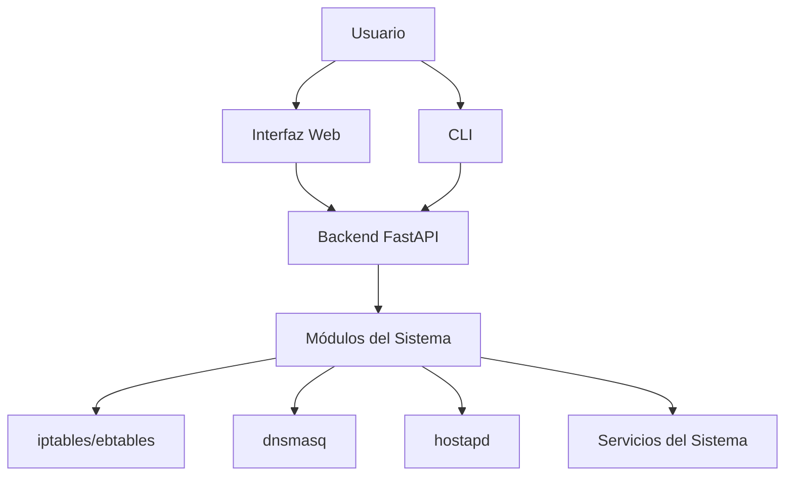
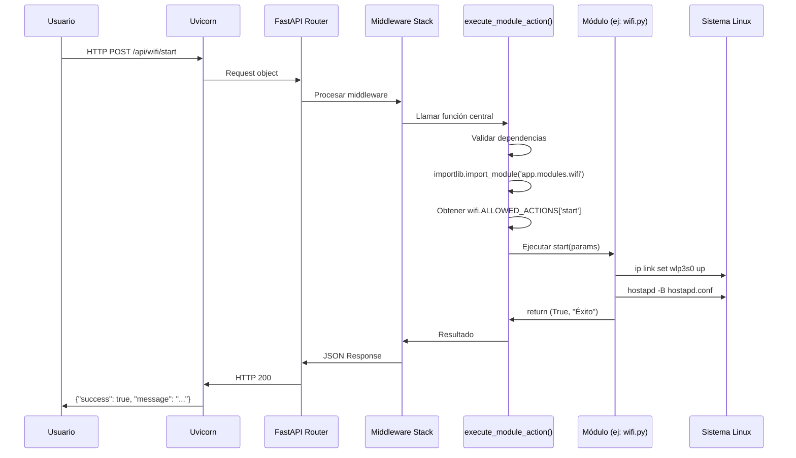
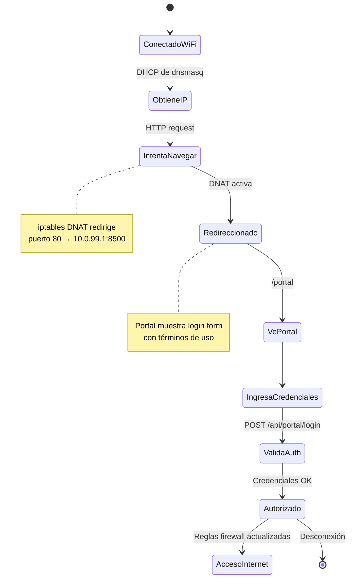
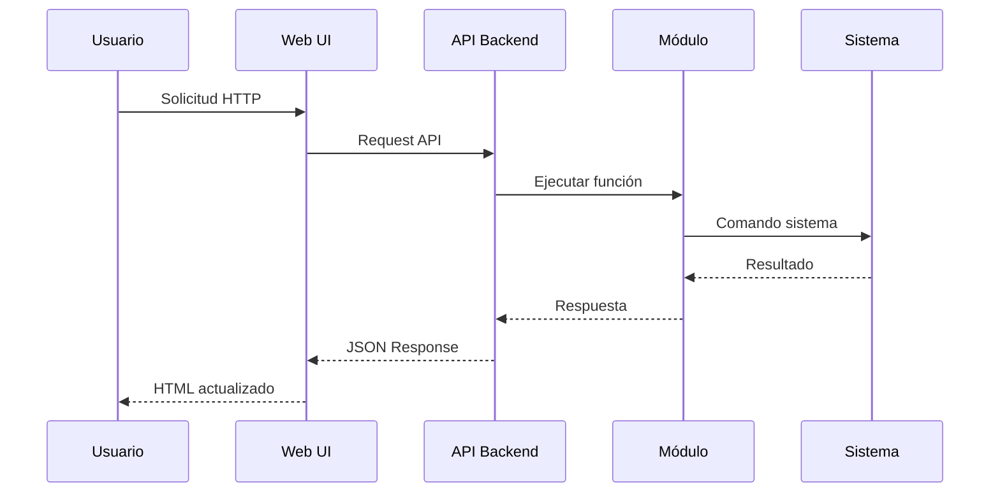
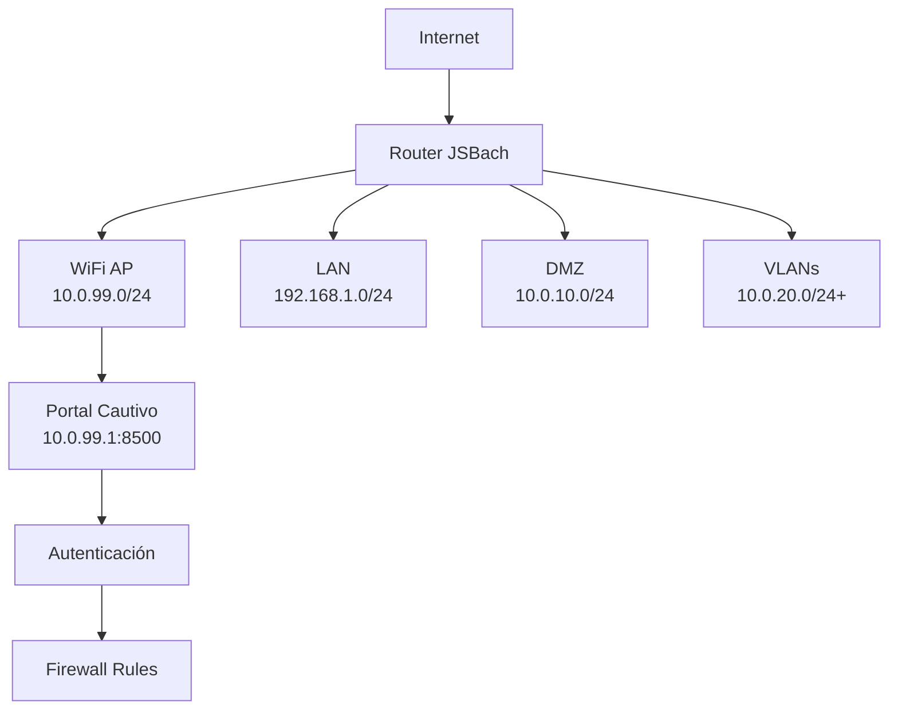
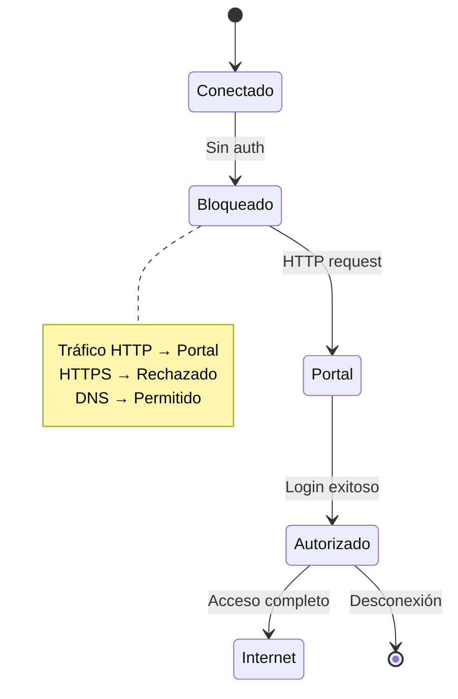

# JSBach - Documentación Técnica Completa

## Índice
1. [Introducción](#introducción)
2. [Arquitectura General](#arquitectura-general)
3. [Instalación y Archivos Generados](#instalación-y-archivos-generados)
4. [Servicios del Sistema](#servicios-del-sistema)
5. [Autenticación](#autenticación)
6. [Backend y API](#backend-y-api)
7. [Módulos del Sistema](#módulos-del-sistema)
8. [Interfaz de Línea de Comandos (CLI)](#interfaz-de-línea-de-comandos-cli)
9. [Reglas de Firewall](#reglas-de-firewall)
10. [Diagramas de Arquitectura](#diagramas-de-arquitectura)

---

## Introducción

JSBach es un sistema de gestión de red avanzado basado en Linux que proporciona funcionalidades de firewall, VPN, WiFi AP, DHCP, NAT, VLANs, y más. Está diseñado para routers y sistemas embebidos, ofreciendo una interfaz web y CLI para configuración y monitoreo.

**Características principales:**
- Firewall avanzado con iptables/ebtables
- Access Point WiFi con portal cautivo
- Servidor DHCP (dnsmasq)
- Gestión de VLANs y NAT
- Interfaz web responsiva
- API REST completa
- Sistema de autenticación MFA

---

## Arquitectura General



El sistema sigue una arquitectura modular con:
- **Frontend:** HTML/CSS/JS para interfaz web
- **Backend:** FastAPI con Uvicorn como servidor ASGI
- **Módulos:** Componentes especializados para cada funcionalidad
- **Sistema:** Integración con servicios Linux nativos

---

## Instalación y Archivos Generados

### Proceso de Instalación

La instalación se realiza mediante los scripts en `scripts/install/`:

1. **install.py:** Realiza todas las tareas necesarias para dejar JSBach operativo. Entre otras acciones:
   - Crea el usuario `jsbach` y ajusta permisos.
   - Genera y habilita los servicios systemd (`jsbach.service`, `jsbach-cli.service`).
   - Crea directorios `config/`, `logs/` y `web/` y coloca los archivos estáticos iniciales.
   - Instala dependencias Python en un entorno virtual y configura UFW/Uvicorn según la plataforma.
   - Escribe los archivos de configuración base (`secrets.env`, `cli_users.json` con admin por defecto, etc.).
   - Opcionalmente integra con UFW añadiendo `/etc/ufw/applications.d/jsbach`.

2. **uninstall.py:** Revierte lo hecho por `install.py`. Entre sus pasos:
   - Detiene y deshabilita los servicios systemd de JSBach.
   - Elimina el usuario `jsbach` y limpia permisos.
   - Borra los directorios `config/`, `logs/` y `web/` junto con cualquier archivo generado.
   - Remueve entradas de UFW relacionadas y restaura reglas anteriores si procede.
   - Opción `--purge` borra también cualquier dependencia instalada y paquetes Python del entorno virtual.

### Archivos Generados Durante la Instalación

#### Servicios del Sistema
- `/etc/systemd/system/jsbach.service` - Servicio principal
- `/etc/systemd/system/jsbach-cli.service` - Servicio CLI
- `/etc/ufw/applications.d/jsbach` - Compatibilidad con UFW

#### Directorios de Configuración
- `/opt/JSBach/config/` - **Configuraciones por módulo generadas dinámicamente**. Los archivos JSON se crean y modifican en tiempo de ejecución por el backend. Por ejemplo, al cambiar una configuración WiFi desde la web, el sistema actualiza `config/wifi/wifi.json` inmediatamente y regenera archivos como `hostapd.conf`.
- `/opt/JSBach/logs/` - Logs de todos los módulos
- `/opt/JSBach/web/` - Archivos estáticos del frontend

#### Archivos de Configuración Específicos
- `config/wifi/hostapd.conf` - Configuración del Access Point
- `config/dhcp/dnsmasq.conf` - Configuración DHCP/DNS
- `config/firewall/firewall.json` - Reglas de firewall
- `config/vlans/vlans.json` - Configuración de VLANs

#### Base de Datos y Almacenamiento
- `config/cli_users.json` - Usuarios de la CLI y la interfaz WEB
- `config/wifi/portal_users.json` - Usuarios del portal WiFi
- `config/secrets.env` - Claves y secretos

Tras completar la instalación, los servicios estarán activos y se podrán realizar las primeras conexiones. El siguiente paso típico para cualquier administrador es autenticarse, ya sea por la web o a través de la CLI (ver sección **Autenticación**).

---

## Servicios del Sistema

### Servicio Principal (jsbach.service)

**Ubicación:** `/etc/systemd/system/jsbach.service`

```ini
[Unit]
Description=JSBach Network Management System
After=network.target

[Service]
Type=simple
User=jsbach
ExecStart=/opt/JSBach/venv/bin/python -m uvicorn app.main:app --host 0.0.0.0 --port 8100
WorkingDirectory=/opt/JSBach
Restart=always

[Install]
WantedBy=multi-user.target
```

**Función:** Inicia el backend principal con FastAPI/Uvicorn en el puerto 8100.

### Servicio CLI (jsbach-cli.service)

**Función:** Mantiene la interfaz de línea de comandos ejecutándose como demonio.

### Función de Uvicorn

Uvicorn es un servidor ASGI (Asynchronous Server Gateway Interface) que:

1. **Ejecuta la aplicación FastAPI** de manera asíncrona
2. **Maneja conexiones HTTP** con alta concurrencia
3. **Proporciona auto-reload** en desarrollo
4. **Integra con systemd** para gestión de servicios
5. **Soporta WebSockets** para funcionalidades en tiempo real

**Configuración típica:**
```bash
uvicorn app.main:app --host 0.0.0.0 --port 8000 --workers 4
```

---

## Autenticación

### Autenticación Web

**Flujo de Login:**

1. **Usuario accede** a `http://router-ip:8100/login`
2. **Formulario HTML** en `web/login.html` envía POST a `/api/auth/login`
3. **Backend valida** credenciales contra `config/cli_users.json` (usa argon2 para hash)
4. **Genera JWT token** usando `utils/crypto_helper.py`
5. **Almacena sesión** en cookie HTTP-only
6. **Redirige** a `/web/index.html` con token válido
7. **Middleware FastAPI** verifica token en cada request subsiguiente

**MFA opcional:** Si habilitado, genera código TOTP y verifica contra `utils/mfa_helper.py`

### Autenticación CLI

La interfaz de línea de comandos se inicia como un servidor TCP que escucha en el puerto 2323. Al establecerse una conexión:

- Se solicita usuario y contraseña.
- Las credenciales se verifican frente a `config/cli_users.json`, donde cada entrada almacena un hash Argon2.
- Una vez validado el usuario, se crea una sesión en memoria asociada al socket; el resto de comandos de esa sesión se ejecutan sin volver a pedir credenciales.
- Si el mismo usuario se conecta desde otra sesión, ambas pueden coexistir independientemente.

El proceso de autenticación CLI utiliza los mismos hashes y políticas de contraseñas que la web, lo que permite gestionar usuarios de forma centralizada.

---

## Backend y API

Tras la autenticación, tanto la interfaz web como la CLI envían solicitudes al backend. Esta sección describe la arquitectura de la aplicación FastAPI y el flujo interno utilizado para ejecutar cualquier acción administrativa (por ejemplo, habilitar la WAN, iniciar el WiFi, modificar reglas de firewall, etc.). A lo largo del documento se utilizará el ejemplo `wan start` y otros similares para ilustrar cómo se traduce una orden del usuario en comandos del sistema.

### Estructura del Backend

```
app/
├── main.py              # Punto de entrada principal - inicia FastAPI
├── api/                 # Endpoints REST de la API
│   ├── main_controller.py
│   ├── portal_server.py
│   └── ...
├── modules/             # ⭐ CORAZÓN DEL SISTEMA - Lógica de negocio especializada
│   ├── firewall/        # Gestión de iptables/ebtables
│   ├── wifi/           # Access Point y portal cautivo
│   ├── dhcp/           # Servidor DHCP con dnsmasq
│   ├── nat/            # Traducción de direcciones
│   ├── vlans/          # Redes VLAN
│   ├── wan/            # Conexiones a internet
│   └── ...
├── utils/               # Utilidades compartidas (auth, crypto, sanitización)
└── cli/                 # Interfaz de línea de comandos
```

**Importancia de `app/modules/`**: Esta carpeta contiene la lógica de negocio de cada funcionalidad. Cada módulo es independiente pero se integra perfectamente. Por ejemplo, el módulo `wifi` no solo configura hostapd, sino que también coordina con `firewall` para crear reglas de portal cautivo y con `dhcp` para asignar IPs.

### Interacción con el Sistema

El backend interactúa con el sistema Linux mediante múltiples mecanismos (comandos, sockets, DBus, etc.) que se activan cuando un módulo recibe una orden. Además de ejecutar operaciones en el kernel, cada módulo mantiene archivos de configuración y registros que documentan su estado.

#### Archivos JSON y Logs por Módulo

- Cada módulo tiene su propio directorio en `config/` con uno o más archivos `.json` que reflejan la configuración activa. El backend lee estos ficheros antes de aplicar cambios y los actualiza tras cada acción.
- Los eventos y resultados se registran en `logs/[module]/[module].log`, generados por `ioh.log_action`. Esto permite auditoría y depuración sin tener que consultar el código.

### Comunicación Frontend‑Backend y Evolución de una Acción

1. **Usuario en el navegador** hace clic en un botón, por ejemplo "Iniciar WAN".
2. La interfaz envía un `POST /api/wan/start` con el cuerpo JSON `{}` a través de Uvicorn.
3. FastAPI enruta la petición hasta `admin_router.execute_module_action` (ver más abajo). Antes de llegar, el middleware verifica la sesión JWT.
4. `execute_module_action` importa dinámicamente `app.modules.wan`, obtiene la función `start` y la ejecuta.
5. El módulo WAN lee `config/wan/wan.json` para conocer interfaces, credenciales, etc.
6. Se ejecutan comandos de sistema (`ip link`, `pppd`, `iptables`, ...).
7. El resultado se escribe de nuevo en `wan.json` (por ejemplo `{"status": "up"}`) y se añade una línea al log: `[2026-03-09 12:00:00] start - SUCCESS: WAN activado`.
8. El backend retorna `{"success": true, "message": "WAN iniciada"}` al frontend.
9. El JavaScript del UI procesa la respuesta y actualiza la vista.

Este flujo demuestra cómo:
- Los ficheros `.json` actúan como la **fuente de verdad** para cada módulo.
- Los **logs** guardan un historial de acciones y son independientes de la interfaz.
- La traducción front‑end → back‑end es casi literal: cada botón o comando CLI se mapea a una llamada a `execute_module_action`.

### Ciclo de Ejecución Detallado

#### Ejemplo: Activar WiFi desde la Interfaz Web

1. **Usuario hace clic en "Activar WiFi"** en `/web/index.html`
2. **JavaScript envía POST** a `/api/wifi/start`
3. **FastAPI endpoint** en `api/wifi.py` recibe la petición
4. **Validación de permisos** usando `utils/auth_helper.py`
5. **Llamada al módulo** `modules/wifi/wifi.py:start()`
6. **Módulo ejecuta comandos:**
   - `ip link set wlp3s0 down`
   - `ip addr add 10.0.99.1/24 dev wlp3s0`
   - `ip link set wlp3s0 up`
7. **Genera configuración** `hostapd.conf` dinámicamente
8. **Inicia hostapd** con `subprocess.Popen(['hostapd', config_file])`
9. **Coordina con firewall** llamando `modules/firewall/helpers.py:setup_wifi_portal()`
10. **Firewall crea reglas:**
    - `iptables -t nat -A WIFI_PORTAL_REDIRECT -j DNAT --to 10.0.99.1:8500`
    - `iptables -A WIFI_PORTAL_FORWARD -j DROP` (para HTTP)
11. **Actualiza estado** en `config/wifi/wifi.json`
12. **Retorna respuesta** JSON al frontend
13. **UI actualiza** mostrando "WiFi Activado"

#### Ejemplo: Comando CLI equivalente

```bash
# Usuario ejecuta en CLI
wifi start

# CLI parser en cli/parser.py interpreta
# Llama a cli/executor.py
# Que ejecuta modules/wifi/wifi.py:start()
# Mismo flujo que arriba, pero sin interfaz web
```

## Módulos del Sistema

Esta función es el **núcleo del sistema** y se usa tanto para web como CLI:

```python
async def execute_module_action(module_name: str, action: str, params: Optional[dict] = None):
    # 1. Validación de dependencias (solo para 'start')
    if action == "start":
        deps_ok, deps_msg = mh.check_module_dependencies(BASE_DIR, module_name)
        if not deps_ok:
            return False, f"No se puede iniciar {module_name}: {deps_msg}"
    
    # 2. Import dinámico del módulo
    module = importlib.import_module(f"app.modules.{module_name}")
    
    # 3. Obtener acciones permitidas
    actions = getattr(module, "ALLOWED_ACTIONS", None)
    if not isinstance(actions, dict):
        return False, f"Módulo '{module_name}' no expone acciones administrativas"
    
    # 4. Obtener función específica
    func = actions.get(action)
    if not callable(func):
        return False, f"Acción '{action}' no permitida"
    
    # 5. Ejecutar función (async o sync)
    if asyncio.iscoroutinefunction(func):
        result = await func(params)
    else:
        result = func(params)
    
    # 6. Procesar resultado y logging
    return bool(success), message
```

**Importancia:** Esta función actúa como **intermediario universal** entre la interfaz (web/CLI) y los módulos especializados.

#### 5. Import Dinámico y Validación

**Import del Módulo:**
- `importlib.import_module(f"app.modules.{module_name}")`
- Carga `app.modules.wifi` en memoria
- Accede a `wifi.ALLOWED_ACTIONS` (diccionario de funciones)

**ALLOWED_ACTIONS en módulos:**
```python
# En modules/wifi/wifi.py
ALLOWED_ACTIONS = {
    "start": start,
    "stop": stop,
    "status": status,
    "configure": configure
}
```

**Validación:**
- Verifica que la acción existe en ALLOWED_ACTIONS
- Confirma que es "callable" (función ejecutable)
- Para `start`: Verifica dependencias del sistema (servicios, archivos, etc.)

#### 6. Ejecución en el Módulo Específico

**Ejemplo: modules/wifi/wifi.py:start()**

```python
def start(params: dict = None) -> tuple[bool, str]:
    try:
        # 1. Leer configuración actual
        config = ioh.read_json_file(CONFIG_PATH)
        
        # 2. Configurar interfaz de red
        subprocess.run(["ip", "link", "set", "wlp3s0", "down"], check=True)
        subprocess.run(["ip", "addr", "add", "10.0.99.1/24", "dev", "wlp3s0"], check=True)
        subprocess.run(["ip", "link", "set", "wlp3s0", "up"], check=True)
        
        # 3. Generar hostapd.conf dinámicamente
        generate_hostapd_config(config)
        
        # 4. Iniciar hostapd
        hostapd_process = subprocess.Popen(["hostapd", "-B", "-P", PID_FILE, HOSTAPD_CONF])
        
        # 5. Coordinar con otros módulos
        from app.modules.firewall import helpers as fw_helpers
        fw_helpers.setup_wifi_portal()
        
        # 6. Actualizar estado
        config["active"] = True
        ioh.write_json_file(CONFIG_PATH, config)
        
        return True, "WiFi AP iniciado correctamente"
        
    except Exception as e:
        return False, f"Error iniciando WiFi: {str(e)}"
```

**Coordinación entre Módulos:**
- El módulo WiFi **no es aislado** - coordina con firewall, dhcp, etc.
- Llama funciones de otros módulos para configuración integrada
- Ejemplo: `fw_helpers.setup_wifi_portal()` crea reglas iptables automáticamente

#### 7. Respuesta y Logging

**Respuesta:**
- **Web:** JSON con `{"success": true, "message": "..."}`
- **CLI:** Formateado con emojis y separadores

**Logging Unificado:**
- Todas las acciones se loggean via `ioh.log_action(module_name, message)`
- Logs van a `logs/[module]/[module].log`
- Incluye timestamp, usuario (si aplica), y resultado

#### Diagrama Detallado del Flujo Interno



**Puntos Clave del Proceso Interno:**

1. **Interfaz Unificada:** Web y CLI usan el mismo `execute_module_action()`
2. **Import Dinámico:** Módulos se cargan en tiempo de ejecución según la orden
3. **Validación Robusta:** Dependencias, permisos, y sintaxis se verifican antes de ejecutar
4. **Coordinación Modular:** Módulos se llaman entre sí para configuración integrada
5. **Logging Centralizado:** Todas las acciones quedan registradas
6. **Manejo de Errores:** Excepciones se capturan y formatean apropiadamente
7. **Async Support:** Funciones pueden ser síncronas o asíncronas según necesidad

Este proceso garantiza que cualquier orden, independientemente de su origen, siga el mismo flujo seguro y validado, resultando en comandos del sistema consistentes y rastreables.


## Módulos del Sistema

Tras entender la autenticación y el paso de órdenes desde el frontend/CLI hasta el backend, es hora de explorar los módulos concretos que realizan el trabajo real. Cada módulo maneja un dominio específico (WiFi, DHCP, firewall, etc.) y expone las acciones que pueden ser invocadas por el backend.

### Estructura General de Módulos

Cada módulo sigue el patrón:

```
modules/[nombre]/
├── __init__.py
├── [nombre].py          # Lógica principal
├── helpers.py           # Funciones auxiliares
├── __pycache__/
└── config/
    └── [nombre].json
```

### Módulo Firewall

**Función:** Gestiona reglas de iptables y ebtables para control de tráfico.

**Archivos clave:**
- `firewall.py` - Lógica principal
- `helpers.py` - Funciones de configuración de reglas

**Interacción con el sistema:**
- Ejecuta comandos `iptables` y `ebtables`
- Gestiona cadenas personalizadas
- Aplica reglas en orden específico

### Módulo WiFi

**Función:** Gestiona Access Point y portal cautivo.

**Componentes:**
- **hostapd:** Servicio del Access Point
- **Portal Server:** Servidor FastAPI dedicado (puerto 8500)
- **dnsmasq:** DHCP para clientes WiFi

**Flujo de funcionamiento detallado:**
1. **Configura interfaz WiFi** con comandos `ip` (down/add/up)
2. **Genera hostapd.conf** dinámicamente desde `config/wifi/wifi.json`
3. **Inicia hostapd** como demonio con PID file
4. **Inicia Portal Server** en puerto 8500 como subproceso separado
5. **Coordina con Firewall** para crear reglas de aislamiento
6. **Configura DHCP** ranges específicos para WiFi

**Portal Cautivo - Funcionamiento Detallado:**



**Cadenas de Reglas Creadas:**

1. **WIFI_PORTAL_REDIRECT (NAT PREROUTING):**
   - **Cuándo se crea:** Al iniciar WiFi con `portal_enabled: true`
   - **Reglas:** `DNAT tcp dpt:80 to:10.0.99.1:8500`
   - **Porqué:** Fuerza que todo HTTP del WiFi vaya al portal
   - **Ejemplo:** Cliente intenta `http://google.com` → redirigido a portal

2. **WIFI_PORTAL_FORWARD (FILTER FORWARD):**
   - **Cuándo se crea:** Al configurar portal
   - **Reglas:** 
     - `DROP tcp dpt:80` (bloquea HTTP no autorizado)
     - `REJECT tcp dpts:443,5228` (bloquea HTTPS/GCM)
     - `RETURN udp dpt:53` (permite DNS)
   - **Porqué:** Previene acceso a internet hasta autenticación
   - **Ejemplo:** Cliente no puede navegar hasta hacer login

3. **WIFI_PORTAL_INPUT (FILTER INPUT):**
   - **Cuándo se crea:** Para acceso al router desde WiFi
   - **Reglas:** Permite DHCP, DNS, portal port, ICMP
   - **Porqué:** Permite comunicación básica con el router

**Ejemplo de Activación:**
- Usuario ejecuta `wifi start` en CLI
- Sistema verifica `config/wifi/wifi.json` para `portal_enabled`
- Si true, llama `firewall.helpers.setup_wifi_portal()`
- Crea cadenas y reglas específicas para WiFi
- Portal server se inicia en background

### Módulo DHCP

**Función:** Proporciona direcciones IP a clientes de red.

**Integración:**
- Usa dnsmasq como backend
- Configura rangos por interfaz
- Gestiona leases de IP

### Otros Módulos

- **NAT:** Gestión de traducción de direcciones
- **VLANs:** Configuración de redes virtuales
- **WAN:** Gestión de conexiones a internet
- **Expect:** Automatización de tareas
- **DMZ:** Zona desmilitarizada
- **Tagging:** Etiquetado de tráfico
- **Ebtables:** Control de capa 2

---

Tras comprender la estructura y funcionamiento de los módulos, el siguiente apartado describe la interfaz de línea de comandos que permite enviar órdenes a esos módulos.

## Interfaz de Línea de Comandos (CLI)

### Arquitectura CLI

```
cli/
├── cli_server.py       # Servidor CLI (demonio)
├── executor.py          # Ejecutor de comandos
├── parser.py            # Parser de comandos
├── session.py           # Gestión de sesiones
└── tcp_server.py       # Servidor TCP para conexiones
```

### Funcionamiento

1. **Servidor TCP:** Escucha en puerto 2323 para conexiones telnet/SSH
2. **Autenticación:** Verifica usuarios contra `config/cli_users.json`
3. **Parser de Comandos:** Interpreta comandos en formato específico
4. **Ejecutor:** Llama a funciones del backend para ejecutar acciones
5. **Sesiones:** Mantiene estado de sesión por usuario

### Comandos Disponibles

Ver `help/CLI_COMMANDS.md` para la lista completa de comandos organizados por módulo.

---

## Reglas de Firewall

### Arquitectura de Reglas

JSBach utiliza una jerarquía de cadenas en iptables/ebtables:

```
PREROUTING (NAT)
├── WIFI_PORTAL_REDIRECT (WiFi) - Prioridad máxima
├── JSB_GLOBAL_PRE
│   ├── JSB_DMZ_STATS
│   └── JSB_DMZ_ISOLATE
└── ...

FORWARD
├── WIFI_PORTAL_FORWARD (WiFi) - Prioridad máxima  
├── JSB_GLOBAL_STATS
├── JSB_GLOBAL_ISOLATE
│   ├── FORWARD_WIFI
│   └── FORWARD_VLAN_*
└── ...

INPUT
├── WIFI_PORTAL_INPUT
└── ...
```

### Cadenas por Módulo

#### 🔥 **Módulo Firewall - Cadenas Principales**

**JSB_DMZ_STATS (NAT PREROUTING):**
- **Cuándo se crea:** Al configurar servicios DMZ en `config/dmz/dmz.json`
- **Reglas creadas:**
  - `LOG tcp dpt:80 prefix "[JSB-DMZ-DNAT] 10.0.10.10:80 "`
  - `DNAT tcp dpt:80 to:10.0.10.10` (servidor web DMZ)
- **Porqué:** Redirige tráfico externo al puerto 80 hacia servidores internos DMZ
- **Ejemplo:** Acceso externo a `http://router-ip` → redirigido a servidor DMZ en 10.0.10.10

**JSB_GLOBAL_ISOLATE (FILTER FORWARD):**
- **Cuándo se crea:** Al activar aislamiento entre VLANs
- **Reglas por VLAN:**
  - `FORWARD_VLAN_1: RETURN` (permite tráfico de VLAN 192.168.1.0/24)
  - `FORWARD_VLAN_10: DROP` (bloquea tráfico de DMZ 10.0.10.0/24 a otras VLANs)
- **Porqué:** Previene comunicación no autorizada entre segmentos de red
- **Ejemplo:** Dispositivo en VLAN 1 no puede acceder a dispositivos en VLAN 10

#### 📶 **Módulo WiFi - Cadenas de Portal**

**WIFI_PORTAL_REDIRECT (NAT PREROUTING):**
- **Cuándo se crea:** `wifi start` con portal habilitado
- **Reglas:** `DNAT tcp dpt:80 to:10.0.99.1:8500`
- **Excepciones:** `RETURN` para MACs autorizadas en `config/wifi/authorized_macs.json`
- **Porqué:** Fuerza portal cautivo para nuevos clientes WiFi
- **Ejemplo:** Cliente WiFi abre navegador → automáticamente redirigido al portal

**WIFI_PORTAL_FORWARD (FILTER FORWARD):**
- **Cuándo se crea:** Al activar portal
- **Reglas secuenciales:**
  1. `RETURN udp dpt:53` (DNS siempre permitido)
  2. `REJECT tcp dpts:443,5228` (bloquea HTTPS/GCM)
  3. `DROP tcp dpt:80` (bloquea HTTP hasta auth)
- **Porqué:** Controla acceso por protocolo hasta autenticación
- **Ejemplo:** Cliente puede resolver DNS pero no navegar hasta login

#### 🏠 **Módulo NAT - Reglas de Traducción**

**JSB_NAT_STATS (FILTER):**
- **Cuándo se crea:** Al configurar reglas NAT en `config/nat/nat.json`
- **Reglas por tipo:**
  - `SNAT` para salida a internet
  - `DNAT` para redirección de puertos
  - `MASQUERADE` para interfaces dinámicas
- **Porqué:** Traduce direcciones para conectividad externa
- **Ejemplo:** Dispositivo LAN 192.168.1.100 accede a internet → IP pública del router

#### 🏷️ **Módulo Tagging - Marcado de Tráfico**

**JSB_TAG_CHAIN (MANGLE):**
- **Cuándo se crea:** Al definir políticas de QoS
- **Reglas:** `MARK` para clasificar tráfico por puerto/protocolo
- **Porqué:** Permite priorización y control de ancho de banda
- **Ejemplo:** Tráfico VoIP marcado con prioridad alta

#### 🌉 **Módulo Ebtables - Control de Capa 2**

**Cadenas principales:**
- **INPUT/OUTPUT/FORWARD** en bridge interfaces
- **BROUTING** para decisiones de bridging

**Reglas por módulo:**
- **WiFi:** Filtrado por MAC address para control de acceso
- **VLANs:** Etiquetado 802.1Q para segmentación
- **Broadcast:** Limitación de tráfico broadcast para performance

**Ejemplo de activación:**
- Comando `ebtables add rule` cuando se configura aislamiento de bridge
- Regla: `-p IPv4 -i eth0 --ip-src 192.168.1.100 -j DROP`

### Ejemplos de Creación Dinámica

**Escenario: Activar Firewall con DMZ**
1. Usuario configura DMZ en interfaz web
2. Sistema actualiza `config/dmz/dmz.json`
3. Módulo firewall verifica configuración
4. **Si no existe JSB_DMZ_STATS:** Crea la cadena
5. **Agrega reglas:** DNAT para puertos configurados
6. **Resultado:** Tráfico externo redirigido a DMZ

**Escenario: Cliente WiFi no autorizado intenta navegar**
1. Cliente envía HTTP request
2. **WIFI_PORTAL_REDIRECT** hace DNAT al portal
3. **WIFI_PORTAL_FORWARD** permite DNS pero bloquea HTTP
4. Cliente ve portal de login
5. Después de auth, reglas se actualizan para permitir acceso

---

## Diagramas de Arquitectura

### Diagrama de Flujo de Datos



### Diagrama Completo: Desde UI hasta Sistema

```mermaid
graph TD
    UI[Usuario en Web UI] --> |Clic "Activar WiFi"| JS[JavaScript POST /api/wifi/start]
    JS --> |HTTP Request| FA[FastAPI Endpoint api/wifi.py]
    FA --> |Valida Token| AUTH[utils/auth_helper.py]
    AUTH --> |OK| MOD[modules/wifi/wifi.py:start()]
    
    MOD --> |Lee config| CONF[config/wifi/wifi.json]
    CONF --> |Genera dinámicamente| HCONF[config/wifi/hostapd.conf]
    
    MOD --> |Ejecuta comandos| SYS[Sistema Linux]
    SYS --> |ip link set wlp3s0 up| NET[Configura interfaz]
    SYS --> |hostapd -B hostapd.conf| HOSTAPD[Inicia Access Point]
    SYS --> |python -m uvicorn portal:app| PORTAL[Inicia Portal Server :8500]
    
    MOD --> |Coordina con| FW[modules/firewall/helpers.py]
    FW --> |setup_wifi_portal()| IPT[Crear reglas iptables]
    IPT --> |WIFI_PORTAL_REDIRECT| NAT[NAT: DNAT puerto 80]
    IPT --> |WIFI_PORTAL_FORWARD| FILT[FILTER: DROP HTTP no auth]
    
    FW --> |Actualiza| JSON[config/firewall/firewall.json]
    
    MOD --> |Retorna| RESP[JSON Response]
    RESP --> |Success| UIU[UI actualiza: WiFi ON]
    
    HOSTAPD --> |Broadcast SSID| WIFI[Red WiFi visible]
    PORTAL --> |Escucha requests| WIFI
    NAT --> |Redirige HTTP| PORTAL
    FILT --> |Bloquea navegación| WIFI
    
    note right of CONF
        Archivos JSON se generan
        y modifican dinámicamente
        en runtime
    end note
    
    note right of SYS
        Comandos del sistema:
        - iptables -A ...
        - systemctl restart ...
        - ip addr add ...
    end note
```

### Diagrama de Red



### Diagrama de Estados del Portal WiFi



---

## Conclusión

JSBach es un sistema complejo que integra múltiples tecnologías Linux para proporcionar gestión de red avanzada. La documentación detallada incluye:

- **Generación dinámica de archivos** de configuración en runtime
- **Interacción detallada** entre componentes con ejemplos concretos
- **Flujos completos** desde UI/CLI hasta comandos del sistema
- **Autenticación web** completa con JWT y MFA opcional
- **Portal cautivo detallado** con estados y transiciones
- **Reglas de firewall por módulo** con casos de uso específicos
- **Diagramas exhaustivos** mostrando el flujo completo de datos

**Puntos clave del funcionamiento:**
- `app/modules/` es el corazón del sistema con lógica especializada
- Los archivos de configuración se generan/modifican dinámicamente
- Cada acción del usuario resulta en comandos específicos del sistema
- Las reglas de firewall se crean condicionalmente según la configuración
- UFW se integra opcionalmente para compatibilidad

Esta documentación proporciona una visión completa de cómo JSBach transforma acciones del usuario en configuración de red a nivel de sistema.

---

*Documentación técnica completa - JSBach*