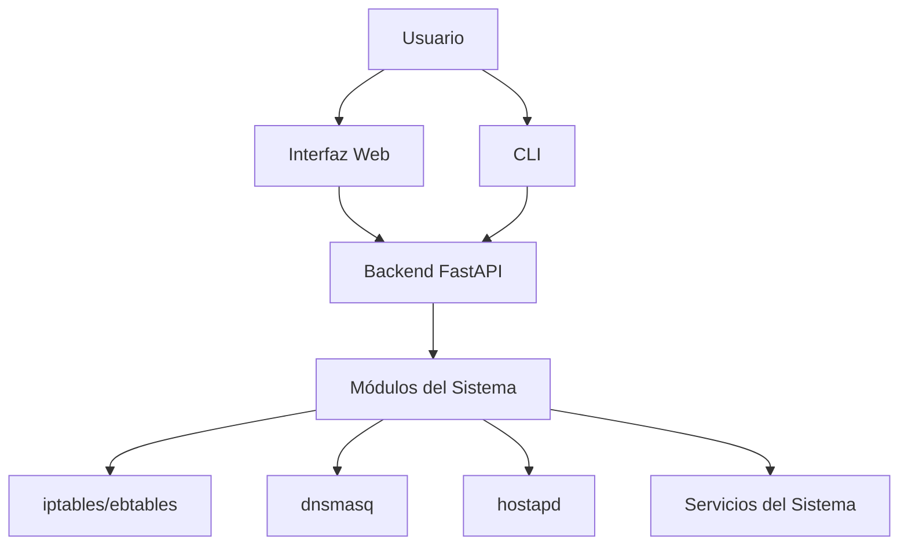
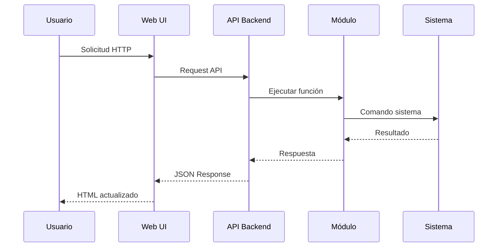
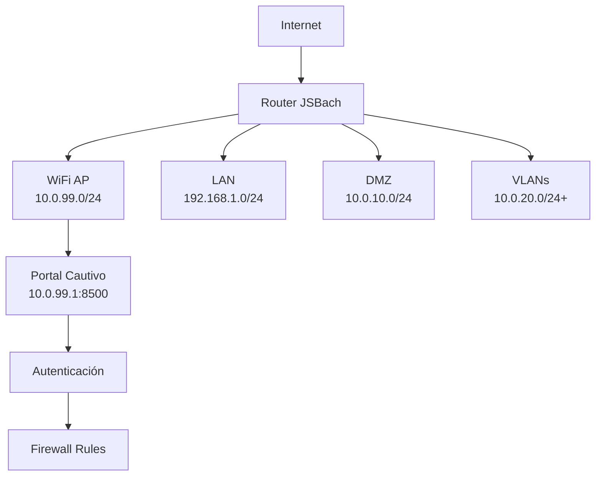

# JSBach - Documentación Compacta

## Índice
1. [Introducción](#introducción)
2. [Arquitectura General](#arquitectura-general)
3. [Instalación y Archivos Generados](#instalación-y-archivos-generados)
4. [Servicios del Sistema](#servicios-del-sistema)
5. [Autenticación](#autenticación)
6. [Backend y API](#backend-y-api)
7. [Módulos del Sistema](#módulos-del-sistema)
8. [Interfaz de Línea de Comandos (CLI)](#interfaz-de-línea-de-comandos-cli)
9. [Reglas de Firewall](#reglas-de-firewall)
10. [Diagramas de Arquitectura](#diagramas-de-arquitectura)

---

## Introducción

JSBach es un sistema de gestión de red avanzado basado en Linux que proporciona funcionalidades de firewall, VPN, WiFi AP, DHCP, NAT, VLANs, y más. Está diseñado para routers y sistemas embebidos, ofreciendo una interfaz web y CLI para configuración y monitoreo.

**Características principales:**
- Firewall avanzado con iptables/ebtables
- Access Point WiFi con portal cautivo
- Servidor DHCP (dnsmasq)
- Gestión de VLANs y NAT
- Interfaz web responsiva
- API REST completa
- Sistema de autenticación MFA

---

## Arquitectura General



El sistema sigue una arquitectura modular con:
- **Frontend:** HTML/CSS/JS para interfaz web
- **Backend:** FastAPI con Uvicorn como servidor ASGI
- **Módulos:** Componentes especializados para cada funcionalidad
- **Sistema:** Integración con servicios Linux nativos

---

## Instalación y Archivos Generados

### Proceso de Instalación

La instalación se realiza mediante los scripts `scripts/install/install.py` (instalación) y `scripts/install/uninstall.py` (desinstalación), que crean servicios systemd, directorios de configuración y archivos base.

### Archivos Generados Durante la Instalación

#### Servicios del Sistema
- `/etc/systemd/system/jsbach.service` - Servicio principal
- `/etc/systemd/system/jsbach-cli.service` - Servicio CLI
- `/etc/ufw/applications.d/jsbach` - Compatibilidad con UFW

#### Directorios de Configuración
- `config/` - Configuraciones por módulo
- `logs/` - Registros de módulos
- `web/` - Archivos estáticos del frontend

#### Archivos de Configuración Específicos
- `config/cli_users.json` - Usuarios CLI y web
- `config/secrets.env` - Claves y secretos
- Archivos JSON por módulo (ej. `config/wifi/wifi.json`)
- `config/wifi/hostapd.conf` - Configuración Access Point
- `config/dhcp/dnsmasq.conf` - Configuración DHCP/DNS

---

## Servicios del Sistema

### Servicio Principal (jsbach.service)

Inicia el backend FastAPI en el puerto 8100 usando `app/main.py` con Uvicorn.

### Servicio CLI (jsbach-cli.service)

Mantiene la interfaz de línea de comandos ejecutándose como demonio en `cli/cli_server.py`.

### Función de Uvicorn

Uvicorn ejecuta la aplicación FastAPI de manera asíncrona, manejando conexiones HTTP con alta concurrencia.

---

## Autenticación

### Autenticación Web

Flujo básico: usuario accede a `web/login.html`, envía credenciales, backend valida contra `config/cli_users.json`, genera JWT, redirige a `web/index.html`.

### Autenticación CLI

Servidor TCP en `cli/tcp_server.py` que solicita usuario y contraseña, valida contra `config/cli_users.json`, crea sesión.

---

## Backend y API

El backend FastAPI maneja solicitudes de web y CLI, ejecutando acciones en módulos especializados.

### Estructura del Backend

```
app/
├── main.py              # Punto de entrada
├── api/                 # Endpoints (ej. api/main_controller.py)
├── modules/             # Lógica especializada
├── utils/               # Utilidades (auth, crypto)
└── cli/                 # Interfaz CLI
```

### Interacción con el Sistema

Los módulos interactúan con el sistema Linux ejecutando comandos y manteniendo archivos de configuración JSON en `config/`.

### Comunicación Frontend‑Backend y Evolución de una Acción

1. **Usuario en el navegador** hace clic en un botón, por ejemplo "Iniciar WAN".
2. La interfaz envía un `POST /api/wan/start` con el cuerpo JSON `{}` a través de Uvicorn.
3. FastAPI enruta la petición hasta `admin_router.execute_module_action` (ver más abajo). Antes de llegar, el middleware verifica la sesión JWT.
4. `execute_module_action` importa dinámicamente `app.modules.wan`, obtiene la función `start` y la ejecuta.
5. El módulo WAN lee `config/wan/wan.json` para conocer interfaces, credenciales, etc.
6. Se ejecutan comandos de sistema (`ip link`, `pppd`, `iptables`, ...).
7. El resultado se escribe de nuevo en `wan.json` (por ejemplo `{"status": "up"}`) y se añade una línea al log: `[2026-03-09 12:00:00] start - SUCCESS: WAN activado`.
8. El backend retorna `{"success": true, "message": "WAN iniciada"}` al frontend.
9. El JavaScript del UI procesa la respuesta y actualiza la vista.

Este flujo demuestra cómo:
- Los ficheros `.json` actúan como la **fuente de verdad** para cada módulo.
- Los **logs** guardan un historial de acciones y son independientes de la interfaz.
- La traducción front‑end → back‑end es casi literal: cada botón o comando CLI se mapea a una llamada a `execute_module_action`.

### Ciclo de Ejecución Detallado

#### Ejemplo: Activar WiFi desde la Interfaz Web

1. **Usuario hace clic en "Activar WiFi"** en `/web/index.html`
2. **JavaScript envía POST** a `/api/wifi/start`
3. **FastAPI endpoint** en `api/wifi.py` recibe la petición
4. **Validación de permisos** usando `utils/auth_helper.py`
5. **Llamada al módulo** `modules/wifi/wifi.py:start()`
6. **Módulo ejecuta comandos:**
   - `ip link set wlp3s0 down`
   - `ip addr add 10.0.99.1/24 dev wlp3s0`
   - `ip link set wlp3s0 up`
7. **Genera configuración** `hostapd.conf` dinámicamente
8. **Inicia hostapd** con `subprocess.Popen(['hostapd', config_file])`
9. **Coordina con firewall** llamando `modules/firewall/helpers.py:setup_wifi_portal()`
10. **Firewall crea reglas:**
    - `iptables -t nat -A WIFI_PORTAL_REDIRECT -j DNAT --to 10.0.99.1:8500`
    - `iptables -A WIFI_PORTAL_FORWARD -j DROP` (para HTTP)
11. **Actualiza estado** en `config/wifi/wifi.json`
12. **Retorna respuesta** JSON al frontend
13. **UI actualiza** mostrando "WiFi Activado"

---

## Módulos del Sistema

Cada módulo maneja un dominio específico y expone acciones para ser invocadas por el backend.

### Estructura General de Módulos

```
modules/[nombre]/
├── __init__.py
├── [nombre].py          # Lógica principal
├── helpers.py           # Funciones auxiliares
└── config/
    └── [nombre].json
```

### Módulos Principales

- **Firewall:** Gestiona reglas en `modules/firewall/`
- **WiFi:** Access Point y portal en `modules/wifi/`
- **DHCP:** Servidor en `modules/dhcp/`
- **NAT:** Traducción en `modules/nat/`
- **VLANs:** Redes en `modules/vlans/`
- **WAN:** Conexiones en `modules/wan/`
- **Otros:** Expect (`modules/expect/`), DMZ, Tagging, Ebtables

---

## Interfaz de Línea de Comandos (CLI)

### Arquitectura CLI

```
cli/
├── cli_server.py       # Servidor demonio
├── executor.py          # Ejecutor de comandos
├── parser.py            # Parser
├── session.py           # Gestión de sesiones
└── tcp_server.py       # Servidor TCP
```

### Funcionamiento

Servidor TCP que autentica usuarios y ejecuta comandos mediante el backend. Comandos disponibles en `help/CLI_COMMANDS.md`.

---

## Reglas de Firewall

JSBach utiliza jerarquías de cadenas en iptables/ebtables para control de tráfico, organizadas por módulos.

### Cadenas por Módulo

- **Firewall:** Cadenas para DMZ, aislamiento global en `modules/firewall/`
- **WiFi:** Cadenas para portal cautivo en `modules/wifi/`
- **NAT:** Reglas de traducción en `modules/nat/`
- **Tagging:** Marcado de tráfico en `modules/tagging/`
- **Ebtables:** Control de capa 2 en `modules/ebtables/`

---

## Diagramas de Arquitectura

### Diagrama de Flujo de Datos



### Diagrama Completo: Desde UI hasta Sistema

```mermaid
graph TD
    UI[Usuario en Web UI] --> |Clic "Activar WiFi"| JS[JavaScript POST /api/wifi/start]
    JS --> |HTTP Request| FA[FastAPI Endpoint api/wifi.py]
    FA --> |Valida Token| AUTH[utils/auth_helper.py]
    AUTH --> |OK| MOD[modules/wifi/wifi.py:start()]
    
    MOD --> |Lee config| CONF[config/wifi/wifi.json]
    CONF --> |Genera dinámicamente| HCONF[config/wifi/hostapd.conf]
    
    MOD --> |Ejecuta comandos| SYS[Sistema Linux]
    SYS --> |ip link set wlp3s0 up| NET[Configura interfaz]
    SYS --> |hostapd -B hostapd.conf| HOSTAPD[Inicia Access Point]
    SYS --> |python -m uvicorn portal:app| PORTAL[Inicia Portal Server :8500]
    
    MOD --> |Coordina con| FW[modules/firewall/helpers.py]
    FW --> |setup_wifi_portal()| IPT[Crear reglas iptables]
    IPT --> |WIFI_PORTAL_REDIRECT| NAT[NAT: DNAT puerto 80]
    IPT --> |WIFI_PORTAL_FORWARD| FILT[FILTER: DROP HTTP no auth]
    
    FW --> |Actualiza| JSON[config/firewall/firewall.json]
    
    MOD --> |Retorna| RESP[JSON Response]
    RESP --> |Success| UIU[UI actualiza: WiFi ON]
    
    HOSTAPD --> |Broadcast SSID| WIFI[Red WiFi visible]
    PORTAL --> |Escucha requests| WIFI
    NAT --> |Redirige HTTP| PORTAL
    FILT --> |Bloquea navegación| WIFI
```

### Diagrama de Red



---

## Conclusión

JSBach integra múltiples tecnologías Linux para gestión de red avanzada. Los puntos clave incluyen arquitectura modular en `app/modules/`, generación dinámica de configuraciones en `config/`, y flujo unificado desde interfaces hasta comandos del sistema.

---

*Documentación compacta - JSBach*